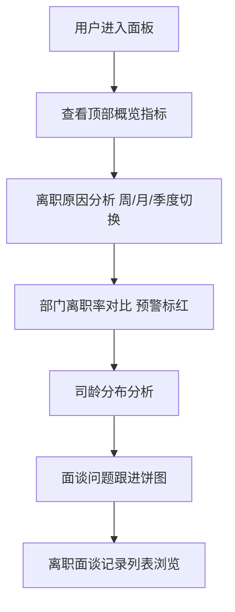

## 1. 产品概述

HR 离职面谈数据分析面板是一款面向企业人力资源管理者与决策层的数据可视化分析工具。通过对离职面谈记录的集中管理与多维度统计分析，帮助企业快速识别离职核心原因、定位高离职率部门、洞察离职员工司龄分布特征，并追踪面谈问题的跟进闭环情况，从而为人才保留策略与组织优化提供数据支撑。目标用户为 HRBP、人力资源总监及企业高管。

## 2. 核心功能

### 2.2 功能模块

1. **离职面谈记录列表**：以表格形式展示完整离职面谈信息，支持离职原因多标签展示与面谈评分查看
2. **离职原因分析模块**：支持按周/月/季度切换的时间维度，统计各离职原因标签频次并生成排行图表
3. **部门离职率对比模块**：横向对比柱状图展示各部门离职率，设置 10% 预警线，超阈值自动标红
4. **司龄分布分析模块**：按试用期/1 年内/1-3 年/3-5 年/5 年+区间统计离职人数占比并可视化
5. **面谈问题跟进模块**：饼图展示未跟进、跟进中、已解决三种状态占比

### 2.3 页面详情

| 页面名称 | 模块名称 | 功能描述 |
|-----------|-------------|---------------------|
| 数据分析面板 | 顶部概览栏 | 展示总离职人数、本月离职率、待跟进问题数等关键指标卡片 |
| 数据分析面板 | 离职原因分析 | 周/月/季度切换，横向条形排行图，区分薪资、管理等原因排序 |
| 数据分析面板 | 部门离职率对比 | 横向柱状图，10% 预警线，超阈值标红 |
| 数据分析面板 | 司龄分布分析 | 漏斗/柱状图展示各司龄段离职占比，标识最集中段 |
| 数据分析面板 | 面谈问题跟进 | 饼图展示三状态占比，中心显示总问题数 |
| 数据分析面板 | 离职面谈记录列表 | 表格展示员工姓名、部门、离职类型、原因标签、去向、面谈评分 |

## 3. 核心流程

用户进入面板后，顶部概览栏展示关键指标；向下滚动依次查看离职原因分析（可切换时间维度）、部门离职率对比（预警标红）、司龄分布、问题跟进饼图；底部为完整离职面谈记录列表，可浏览每条记录详情与多标签原因。各图表模块均支持交互式 hover 与图例筛选。

## 4. 用户界面设计

### 4.1 设计风格

- **主色调**：深色科技背景（深蓝灰 #0f172a），数据强调色采用青绿 #14b8a6、珊瑚红 #f43f5e、琥珀 #f59e0b、紫罗兰 #8b5cf6
- **按钮风格**：圆角胶囊式，时间切换采用分段控制器（segmented control）
- **字体**：显示字体使用 DM Serif Display（标题）+ 思源黑体（正文），数字使用等宽字体突出数据感
- **布局风格**：卡片式栅格布局，顶部指标卡 + 中部双列图表 + 底部全宽表格
- **图标风格**：线性图标，搭配数据色块

### 4.2 页面设计概览

| 页面名称 | 模块名称 | UI 元素 |
|-----------|-------------|-------------|
| 数据分析面板 | 顶部概览栏 | 4 个指标卡，渐变图标，数字滚动动画 |
| 数据分析面板 | 离职原因分析 | 分段控制器 + 横向条形图，渐变色条，hover 高亮 |
| 数据分析面板 | 部门离职率对比 | 横向柱状图，10% 红色虚线预警线，超阈值柱体标红 |
| 数据分析面板 | 司龄分布 | 渐变柱状图，最集中段高亮，占比标签 |
| 数据分析面板 | 问题跟进 | 环形饼图，中心总数字，图例联动 |
| 数据分析面板 | 记录列表 | 斑马纹表格，多标签彩色 chip，评分星级 |

### 4.3 响应式

桌面优先设计，最小宽度 1280px 最佳；平板端自适应收缩为单列；移动端隐藏部分次要图表列。
