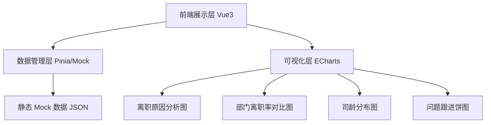
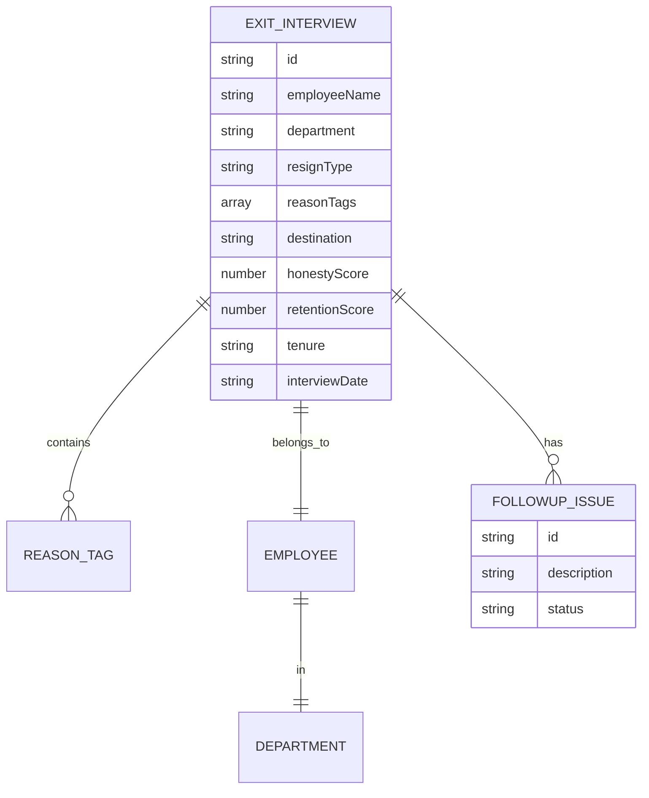

## 1. 架构设计

## 2. 技术说明

- **前端**：Vue@3 + ECharts@5 + Vite
- **样式方案**：原生 CSS 变量 + Scoped 样式（无需 Tailwind，保持轻量）
- **初始化工具**：vite-create（npm create vite@latest）
- **后端**：无（纯前端 Mock 数据）
- **数据**：内置 Mock 数据集，模拟 40+ 条离职面谈记录与统计聚合数据

## 3. 路由定义

| 路由 | 用途 |
|-------|---------|
| / | 单页面数据面板，包含全部 5 大模块 |

## 4. 数据模型

### 4.1 数据模型定义

### 4.2 数据定义

离职原因标签枚举：薪资、管理、发展、加班、通勤、家庭、健康
司龄区间枚举：试用期内、1 年内、1-3 年、3-5 年、5 年+
问题跟进状态枚举：未跟进、跟进中、已解决
离职类型枚举：主动离职、被动离职、协商解除、合同到期
